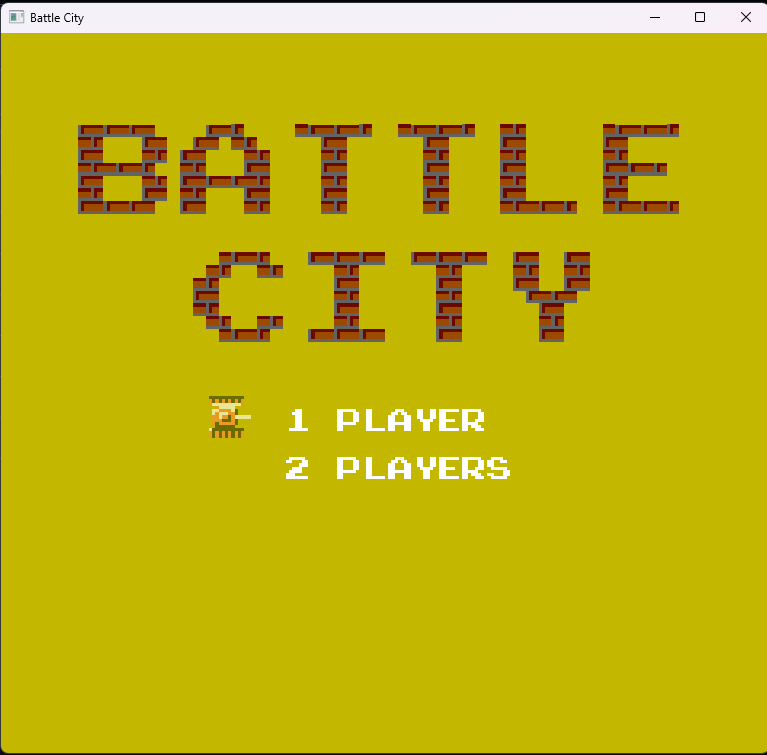
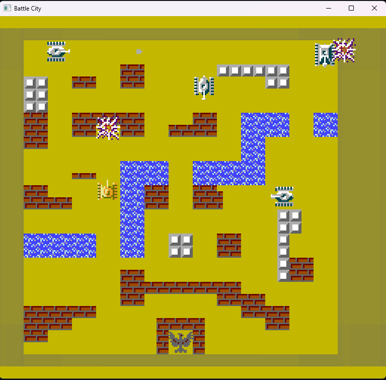
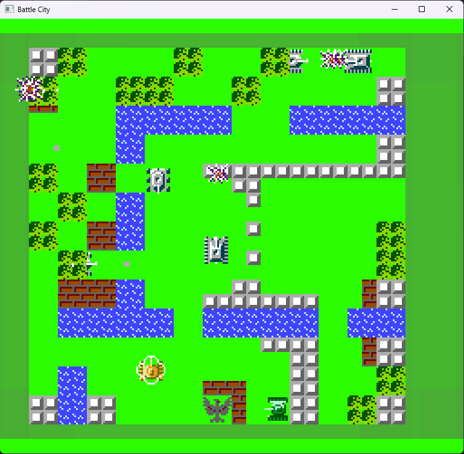

### BattleCity на CPP!

Этот проект я писал ещё в 15 лет, а потому нормальной инструкции как запустить игру не будет. Могу лишь посоветовать сделать следующее:
```
mkdir build
cd build
cmake .. -G "Visual Studio 17 2022"
```

а потом ещё поменять абсолютные пути в CMakeList.txt на свои=)

Зааатем запускаем main.cpp в VS, предаврительно добавив в папку с EXE все нужные DLL от SFML =)

Ну простите меня, я тогда вообще бобиков был =)

# Важно!

Мне 15 летнему показалось, что будет интересно сделать фон переливающимся. И он как бы прикольно переливается, если exe запускать на GPU, а на CPU это смерть для эпелепсика. Чтобы выключить переливание цвета нужно нажать `O`

### Скрины



